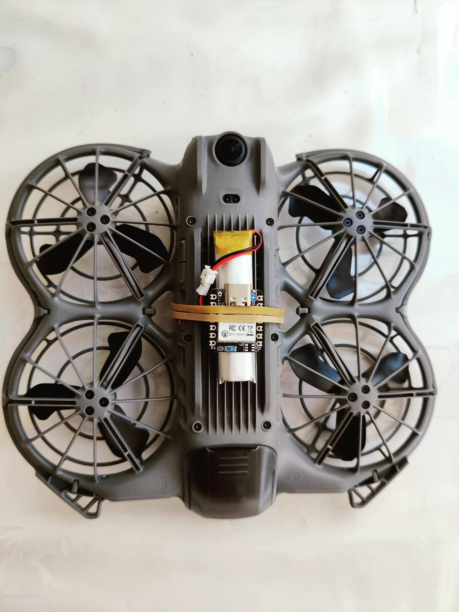

# xiao_nrf52_updater


A standalone BLE DFU client that runs on a **Seeed XIAO nRF52840**, **RAK4631** (with RAK15001 QSPI flash) and flashes Nordic-format firmware bundles to *other* nRF52 devices over Bluetooth. Drag a `.zip` onto the board's USB drive, eject it (or unplug if running on battery), and the board connects to a nearby DFU target and flashes it.

<p align="center">
  <br>
  <sup>DJI Neo 2 with Seeed Xiao nRF52 and 600mA battery: 10g payload</sup>
</p>

Intended use: a drone-mounted OTA flasher that updates a hard to reach nRF52 repeater in the field.

## What's in the box

| Component | Role |
|---|---|
| **USB MSC** | Exposes a 2 MB QSPI flash as a FAT12 USB drive (label `XIAO DFU` on XIAO, `RAK DFU` on RAK4631). The host drops the host firmware `.zip` and the `CONFIG.TXT` here. |
| **`CONFIG.TXT`** | `key=value` config (BLE name filter, PRN, MTU, retries, min RSSI, retry cooldown). |
| **`LOG.TXT`** | Append-only log written by the firmware between sessions. |
| **BLE central** | Bluefruit central; scans for the Nordic Legacy DFU service UUID. |
| **DFU client** | Implements the Nordic Legacy DFU protocol (mirrors the Android `LegacyDfuImpl.java`), including the buttonless trigger for app-mode targets. |

## Workflow

1. Plug the XIAO into a host. The `XIAO DFU` drive appears.
2. Drop a firmware bundle (`*.zip` produced by `nrfutil pkg generate`) into the drive root.
3. Copy a `CONFIG.TXT` from the repo and change `ble_name`, so it matches with BLE name you want to update. example: `RAK4631_OTA`
4. **Eject the drive** (or unplug if the XIAO is battery-powered).
5. The XIAO scans for a target advertising the Legacy DFU service, optionally sends the buttonless trigger to kick it from app mode into bootloader, then runs the full DFU sequence.
6. On success the `.zip` is deleted from the drive; the `LOG.TXT` keeps the history.

## Triggers

Two ways to start a DFU sequence:

| Trigger | When | How it's detected |
|---|---|---|
| **Eject** | Host ejects the drive (USB still connected) | SCSI Start-Stop Unit (`load_eject=1, start=0`) callback |
| **Boot off battery** | XIAO powers up with no VBUS and a `.zip` already on the drive | `NRF_POWER->USBREGSTATUS` read at boot |

Only one runs per boot; after success or final failure the firmware sits idle until reboot.

## CONFIG.TXT

Optional. `key=value` per line, `#` or `;` start a comment, whitespace trimmed. Missing keys use defaults.

```
# Substring filter for advertised BLE name. Empty = any peer with DFU service.
# Multiple names can be OR'd with '|', useful when an app and its bootloader
# advertise under different names, like oltaco's OTAFIX bootloader does
ble_name=RAK4631 | 4631_DFU

# Packet Receipt Notification cadence (writes per ACK from the peer).
# 10 is the safe Nordic default. Higher = faster but risk overflowing the
# peer's RX queue.
prn=10

# Negotiate MTU 247 after connect (5–10x faster stream).
# Some older bootloaders ignore the request and we fall back to 20 B writes.
high_mtu=1

# Number of DFU attempts before giving up.
retries=3

# Seconds to wait between failed attempts. The bootloader needs time to
# settle after a reset before it'll accept another START_DFU.
retry_cooldown=5

# Minimum RSSI (dBm, negative). Ads weaker than this are rejected during
# scan. -127 = no minimum. Useful on a drone to refuse flashing when
# the signal isn't strong enough to reliably stream.
min_rssi=-60

# BLE TX power in dBm. nRF52840 allowed values:
#   -40, -20, -16, -12, -8, -4, 0, 2, 3, 4, 5, 6, 7, 8
# Default 0. Crank to 8 for max range; anything not in the list is
# silently rejected and the SoftDevice keeps the previous level.
tx_power=8

# Scan timeout in seconds. 0 = scan forever (the default; intended for
# drone use where the target may take minutes to come into range).
# Non-zero caps the wait; on expiry the sequence gives up without
# consuming any DFU retry slot.
scan_timeout=0

# When set, every rejected advertisement is logged with reason + MAC.
# Useful for diagnosing "my target isn't being picked up". Off in the field.
scan_debug=0
```

Notes:

- A configured `ble_name` switches the scanner from UUID matching to **name-substring** matching. Most Nordic app-mode firmwares expose the Legacy DFU service in their GATT database but do not advertise the UUID; matching on the device name is the only way to find them before connecting. Without `ble_name`, only peers that explicitly advertise the Legacy DFU service UUID are considered (typical of bootloader-mode targets).
- `ble_name` accepts multiple substrings joined by `|`. Example: `RAK4631 | 4631_DFU` matches the RAK app *and* its bootloader, which advertise under different names.
- **MAC+1 fallback after buttonless**: after we send the buttonless trigger, the next scan automatically also accepts the same MAC or MAC+1 (Nordic's bootloader convention). This is on top of the name filter, so even if the bootloader's name doesn't match `ble_name`, the address-based fallback finds it.

`retries` only counts post-scan DFU attempts. Scan failures (with `scan_timeout=0`, impossible) and buttonless triggers don't consume retries.

## LED indicators

XIAO has 3 LEDs (R/G/B, active-low). RAK4631 has 2 (green + blue, active-high) and uses an alternating pattern to signal failure instead of a red LED.

| State | XIAO | RAK4631 |
|---|---|---|
| Idle, no host | BLUE slow blink (~1 Hz) | BLUE slow blink (~1 Hz) |
| Host has the drive mounted | BLUE solid | BLUE solid |
| DFU running, streaming | GREEN blink, period shrinks 0%→95% | same |
| DFU succeeded | GREEN solid | GREEN solid |
| DFU failed (after retries) | RED solid | GREEN+BLUE alternating ~4 Hz |

The progress LED is driven from inside the DFU stream loop (the main loop is blocked during DFU), so it animates in real time.

## LOG.TXT

Lines are `[hh:mm:ss] message`. Timestamps are boot-relative - there's no RTC.

The log is mirrored to both Serial (USB CDC) and to `LOG.TXT` on the drive. **The file write is skipped while the host has the drive mounted** - SdFat and the host can't safely share the FAT cache, so we wait until the drive is ejected to flush. Serial output is always live.

| Drive state | Serial | LOG.TXT |
|---|---|---|
| Mounted on host | ✓ | skipped |
| Ejected (USB still plugged) | ✓ | ✓ |
| USB unplugged | nothing reads it | ✓ |

## Supported DFU bundles

| Manifest section | Supported | Notes |
|---|---|---|
| `application` | yes | App-only update. |
| `bootloader` | yes | Bootloader-only update. |
| `softdevice` | yes | SoftDevice-only update. |
| `softdevice_bootloader` | yes | SD+BL combined. Reads `sd_size` / `bl_size` from manifest (both top-level and `info_read_only_metadata` shapes accepted). |
| `softdevice_bootloader_application` | no | Two-connection flow not implemented yet. |

ZIPs must use `STORE` (no compression). This is what `nrfutil pkg generate` produces by default.

The `.zip` is validated by parsing `manifest.json` and locating the `.bin` + `.dat` referenced inside. The `.dat` (init packet) is required for any peer reporting DFU version ≥ 0.5.

## Build & flash

Two build environments are available:

| `pio` env | Board | QSPI flash | Drive label |
|---|---|---|---|
| `xiao_nrf52840` | Seeed XIAO nRF52840 | on-board Puya P25Q16H (2 MB) | `XIAO DFU` |
| `rak4631` | RAKwireless RAK4631 | external RAK15001 module - GigaDevice GD25Q16 (2 MB) | `RAK DFU` |

```bash
pio run -e xiao_nrf52840                  # build XIAO target
pio run -e xiao_nrf52840 -t upload        # flash XIAO via factory bootloader (nrfutil)

# or
pio run -e rak4631                        # build RAK target
pio run -e rak4631 -t upload              # flash via factory bootloader (nrfutil)

# optional debug
pio device monitor                        # 115200 baud, watches serial
```

Requirements: PlatformIO with the upstream `nordicnrf52` platform. The project's `platformio.ini` pins the BSP to a meshcore-dev fork of `framework-arduinoadafruitnrf52` (BLE stack patches). Board JSONs and linker script are vendored under `boards/`. Variants under `variants/xiao_nrf52/` and `variants/rak4631/`.

No bootloader replacement is required on either board — the factory UF2 bootloader works.

## Project layout

```
src/
  main.cpp           - state machine, LED rendering, triggers, glue
  storage.{h,cpp}    - QSPI flash bring-up, FAT12 mount, mini-formatter
  usb_msc.{h,cpp}    - TinyUSB MSC class, eject detection via SCSI Start-Stop
  logger.{h,cpp}     - printf-style logger to Serial + LOG.TXT
  config.{h,cpp}     - CONFIG.TXT parser
  zip_reader.{h,cpp} - minimal STORE-only ZIP walker
  firmware_zip.{h,cpp} - manifest.json parsing, locates .bin + .dat
  ble_scanner.{h,cpp}  - Bluefruit central scan, UUID + pipe-delimited name + RSSI + MAC/MAC+1 filtering
  dfu_legacy.{h,cpp}   - Legacy DFU client state machine (mirrors LegacyDfuImpl.java)
boards/              - board JSONs (xiao, rak4631) + s140 linker script
variants/xiao_nrf52/ - XIAO pin map + variant.cpp (BSP doesn't ship one)
variants/rak4631/    - RAK4631 (WisBlock) pin map + variant.cpp
```

## Known limitations

- Single-LUN MSC; only one zip is expected.
- Combined SD+BL+App in a single zip isn't supported.
- No Secure DFU (only Legacy, as per the project scope).
- No host-set wall clock; `LOG.TXT` timestamps are boot-relative.
- Progress LED + DFU stream both share the main thread, so log throughput in the stream loop is the bottleneck. With `high_mtu=1` we get ~14 KB/s, which means ~13 s for a 191 KB SD+BL bundle.
- Logs written *before* the host first ejects don't reach `LOG.TXT` (Serial-only).

## References

- [Nordic nRF5 SDK Legacy DFU](https://infocenter.nordicsemi.com/topic/sdk_nrf5_v17.1.0/lib_bootloader_dfu_keys.html) - protocol spec the client is built against.
- [Android DFU Library](https://github.com/nordicsemi/Android-DFU-Library) - authoritative reference for legacy DFU protocol.
- [Adafruit nRF52 Bootloader](https://github.com/adafruit/adafruit_nrf52_bootloader) - USB/MSC code, the reference for FAT layout + UF2.
